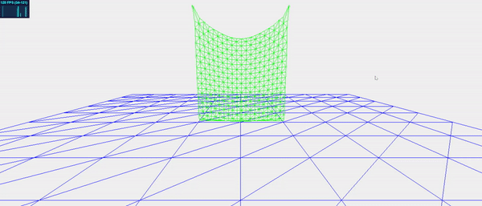
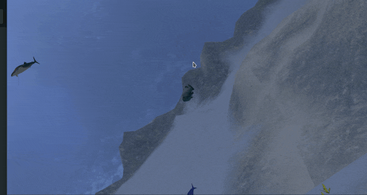

# Paritosh Sharma - Computer Graphics Research  [CV](./CV.pdf)

## About Me

I am a PhD student at [Laboratoire Interdisciplinaire des Sciences du Numérique](https://www.lisn.upsaclay.fr){:target="_blank" rel="noopener"} working under [Michael Filhol](https://www.lisn.upsaclay.fr/membres/filhol-michael/){:target="_blank" rel="noopener"} in team [LIPS](https://www.lisn.upsaclay.fr/research/research-departments/sciences-and-language-technologies/lips/?lang=en){:target="_blank" rel="noopener"}. 
I received my Bachelor of Technology at [SRM Institude of Science and Technology](https://www.srmist.edu.in){:target="_blank" rel="noopener"} and then my Master of Science at [Université Grenoble Alpes](https://mosig.imag.fr){:target="_blank" rel="noopener"}
My Ph.D. work focuses on animating sign language descriptions using 3D Avatars.

You can contact me [here](mailto:paritosh.sharma@universite-paris-saclay.fr)

## Research

My research interests have been in the fields of Computer Graphics, Robotics and Human-Computer Interaction.

### Synthesis for AZee expressions
Currently, I [work](https://phd.paritosh-sharma.com/) on animating AZee(a sign language description language) expressions using avatars.

### Interaction methods for eye tracking for cognitively disabled people
During my M1 thesis, my work aimed at improving the eye interaction methods for [GazePlay](https://gazeplay.github.io/GazePlay/){:target="_blank" rel="noopener"}.

## Teaching
- Computer Graphics for Data Science, IUT d'Orsay, 2022 - Present
- Introduction to Computer Graphics, Polytech Paris Sud(English), 2023 - Present
- Human Computer Interaction, Polytech Paris Sud, 2023 - Present
- Introduction to Artificial Intelligence, IUT d'Orsay, Spring 2023
- Introduction to Object Oriented Programming, IUT d'Orsay, Fall 2021

## Projects

### Simulator for Mass Spring Systems
[Demonstration](https://paritosh-sharma.com/mass-spring-simulator/){:target="_blank" rel="noopener"} of several algorithms for Mass Spring Systems. Such systems are utilised for simulation of cloth and hair particles in computer graphics.
\
\

## Jam Games
Check out games developed by me during game jams [here](https://paritosh.itch.io/){:target="_blank" rel="noopener"}.

### Underwater scene using OpenGL
An [underwater scene](https://github.com/Paritosh97/underwater-opengl){:target="_blank" rel="noopener"} implemented using PyOpenGL and GLFW during my course [3D Computer Graphics](https://chamilo.grenoble-inp.fr/courses/ENSIMAG4MMG3D6/){:target="_blank" rel="noopener"}.
\
\

### Mobile VR integration for Godot
During my [GSoC 2018](http://paritosh-sharma.com/gsoc-2018/){:target="_blank" rel="noopener"}, I worked on integrating GearVR and Google DayDream for [Godot Engine](https://godotengine.org/){:target="_blank" rel="noopener"}.

### Unity and Godot projects
- Cricket Game for meta headsets
- 3D Mobile VR Painting

## Talks

### KDE Akademy 2020
[Talk](https://www.youtube.com/watch?v=-KXb1Vte940){:target="_blank" rel="noopener"} on adding a [Qt3D based backend](http://paritosh-sharma.com/gsoc-2020/){:target="_blank" rel="noopener"} for popular planetarium software [KStars](https://edu.kde.org/kstars/){:target="_blank" rel="noopener"}.

### UGA i-Days 2020
An application idea pitched in the fields of Nutrition, AI, and IoT that aims at solving Vitamin D deficiencies in the elderly. Our team was awarded bronze medal for this idea.